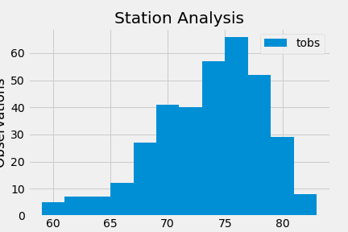
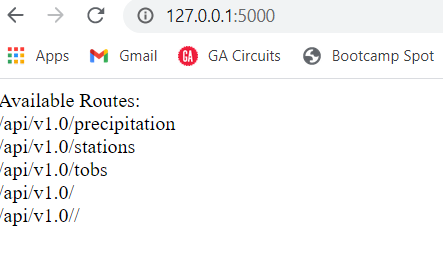
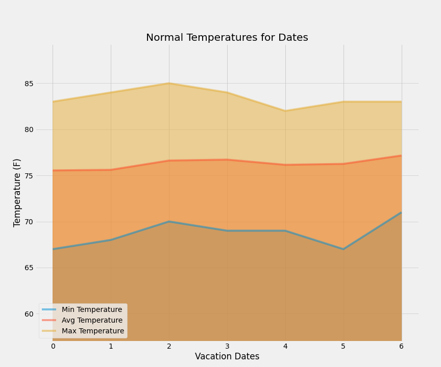

# SQLAlchemy: Surfs Up!

Congratulations! You've decided to treat yourself to a long holiday vacation in Honolulu, Hawaii! To help with your trip planning, you need to do some climate analysis on the area. The following outlines what you need to do.

## Analysis

Use Python and SQLAlchemy to do basic climate analysis and data exploration of your climate database. 

### Precipitation

### Statistical Summary

### Histogram

Sorting the station with the most results and ploting the temperatures observed. 

### Create a Flask based API

### Further Exploration

 

### Plotting the min, avg, and max temperature from a previous query as a bar chart.

### Area plot for the daily normals of days for a planned vacation

